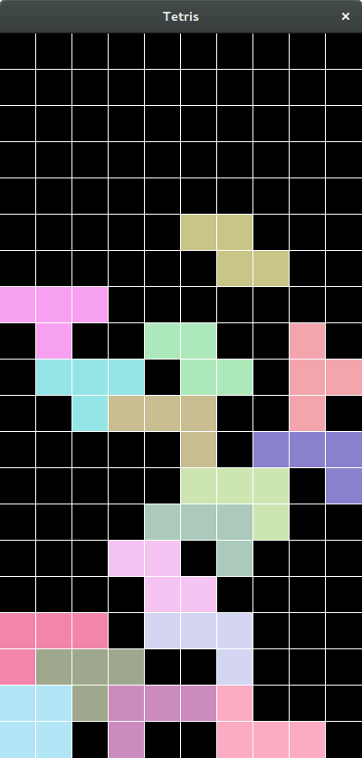

# Classical Tetris Game by C++ & OpenGL
## requirement
- c++ 11
- opengl 3.2
- freeglut
- glew
## build
- Use `make` command to compile.
- `make clean` & `make clean_object` to clean.
## run
- run `tetris` that will be generated after compilation.

## control
- arrow key to move/rotate
- `r` to restart game
- `esc` to exit
## config
edit `include/config.h` to config some basic variables:
- size of map
- the auto dropdown time delay
- and so on